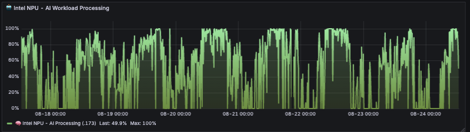

# Intel NPU Prometheus Exporter

Exports Intel Neural Processing Unit (NPU) telemetry to Prometheus for monitoring with Grafana.



## Quick Start

### Clone Repository
```bash
git clone https://github.com/DMontgomery40/npu-telemetry-to-prometheus.git
cd npu-telemetry-to-prometheus
```

### Direct Python
```bash
pip install -r requirements.txt
python3 intel_npu_exporter.py
```

### Docker
```bash
docker-compose up -d
```

## Usage

- Metrics exposed on `http://localhost:8000/metrics`
- Uses `/sys/devices/pci0000:00/0000:00:0b.0/power/runtime_active_time` for NPU runtime data
- Provides both cumulative runtime and usage percentage metrics

## Metrics

- `intel_npu_runtime_milliseconds`: Cumulative NPU active runtime
- `intel_npu_usage_percent`: Current NPU utilization percentage

## Tools

- `intel_npu_exporter.py`: Prometheus exporter service  
- `npu-top.py`: Interactive NPU usage monitor (like htop for NPU)

## Configuration

Set `NPU_EXPORTER_PORT` environment variable to change the default port (8000).